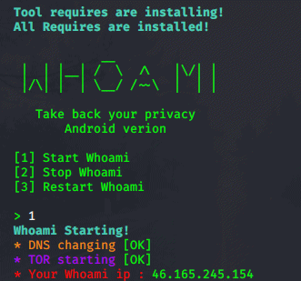

# Whats whoami?
Whoami is a tool created to anonymize your system as much as possible. You can understand the status of the transactions from the "SUCCESSFUL" or "FAİL" text and if all process ended successful finally you can see your fake ip address.
## Usage
The tool is as user-friendly as possible and is designed for easy use by anyone.
After downloading, open a terminal and enter the command "*sudo whoami-android-version.sh*". It will automatically install the packages necessary for its operation and delete everything that is not needed.When the menu opens, enter the number of the mod you want applied and press enter.**That's all that simple** 
## Do not forget !
[-] Whoami accepts no liability for illegal use  
[-] Whoami is not magic, everyone knows that there is no hundred percent security on the Internet, the tool can not make you completely anonymous, but do not doubt that you can do it at the highest level. 
## Bug report
If you find any bug, please contact me at the addresses below.   
Instagram : https://www.instagram.com/_omerr.dogan_/   
E-mail    : omerdgn739@gmail.com   
Udemy     : https://www.udemy.com/user/omer-dogan-15/   
          

